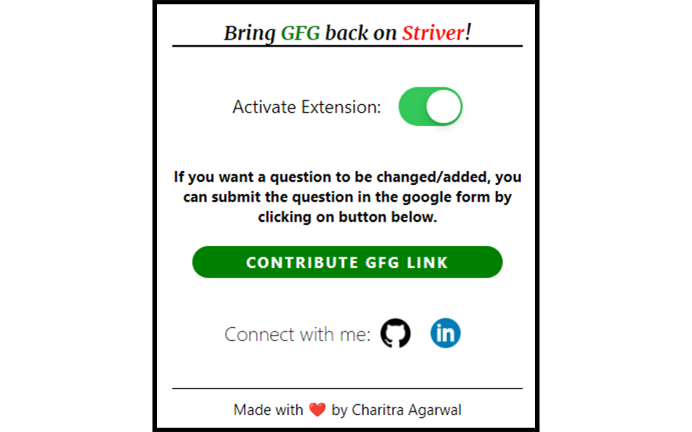

# GFG-ON-STRIVER
A chrome extension that adds back GFG links on striver's sde sheet.

## Screenshots

How the sheet looks like 👇

The extension popup 👇

How the sheet looks like after activating the extension 👇

## Bug notice

Due to the way Striver's website is made, the contents are rendered after the page is loaded.
Because of this behaviour, the extension doesn't load automatically on webpage load.

The extension popup needs to be opened for the update to take place.

This can be fixed if a background service enables the extension after some seconds once webpage is loaded or checking if the content has been added to the page.

This will be fixed in later updates, thanks for using this extension!

#### Special thanks to Raj Vikramaditya (Striver) for his valuable contribution towards the student community and making educational content accessible to all!
